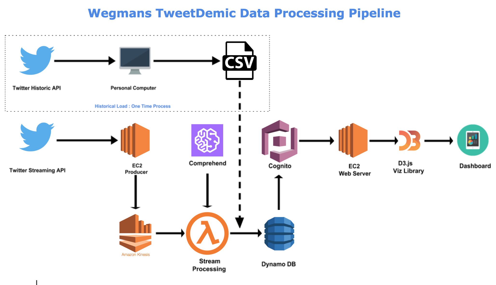

# TweetDemic
## Project Goal and Problem Statement

The project's goal is to build a system that collects Twitter data, both historical and live streamed data for hashtag ‘#Wegmans’, derive and visualize the sentiments in these tweets.

The objective was to create a live monitor that could help the supermarket management monitor public sentiments, more specifically negative sentiments, immediately identify them and take corrective actions wherever necessary.

Wegmans is american supermarket mostly found at northeastern united states.

